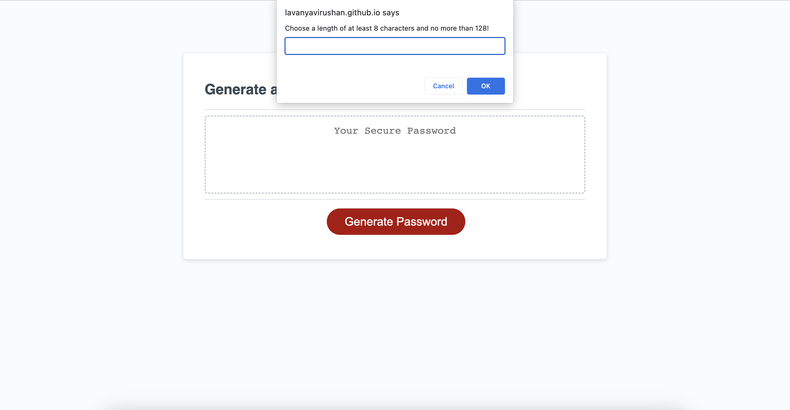
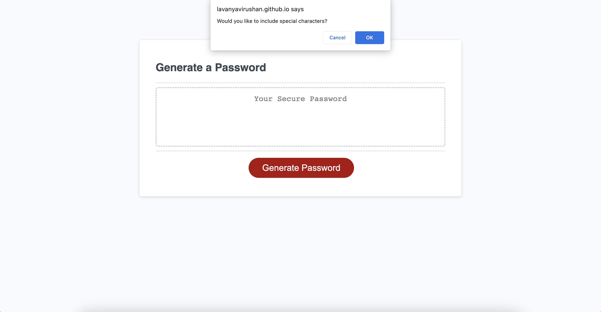
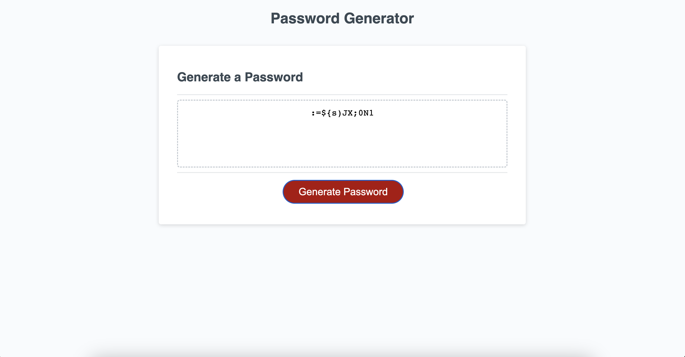

# Password Generator

## Description

This week we created an application that allows users to generate a random password based on the criteria they've selected. It will run in the browser, allowing users to input a password length between 8 to 128, and choose characters of lowercase, uppercase, numeric and/or special characters.

## Usage

To randomly generated password.

## Link to site

[Lavanya's Module 3 Challenge link](https://lavanyavirushan.github.io/m3c-password-generator/)

## GitHub link

[Lavanya's GitHub Repository] (https://github.com/lavanyavirushan/m3c-password-generator)

## Screenshot of the site

## License

Please refer to the LICENSE in the repo.
